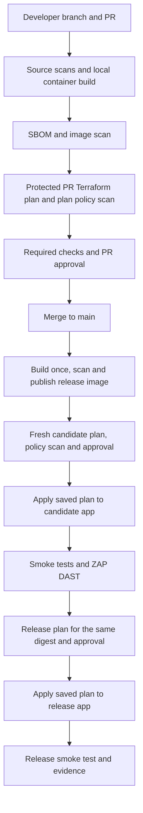

# Azure DevSecOps lab implementation plan

Status: subscription and Owner access verified; minimal Terraform bootstrap implemented and planned, not applied. Created 8 September 2026; updated 14 September 2026. See [lab evidence](lab-evidence.md) for checks and outstanding work.

This is our working checklist for deploying this repository through Azure DevOps to Azure Container Apps, enforcing security gates, and removing the lab afterwards. We will complete one phase at a time and record evidence before moving on. Creating this plan does not provision infrastructure or configure external accounts.

Configuration policy: Terraform will manage Azure resources and supported Azure DevOps configuration from this point forward. Git remains responsible for application/pipeline source, and pipeline jobs build images and execute scanners. Interactive sign-in, approvals, billing agreements and any unsupported account-level operations remain separate prerequisites; do not hide them in Terraform `local-exec` scripts.

## 1. Outcome and starting point

The completed lab will demonstrate a protected pull request, source and container security checks, reviewed Terraform plans, deployment through federated identity, DAST against a candidate deployment, promotion of the tested image, rollback, and verified teardown.

The repository currently contains:

- A static HTML/CSS/JavaScript site in `site/`.
- An nginx image built by `Dockerfile`, currently using `nginx:1.27-alpine`.
- An nginx configuration listening on port 80 and local Docker Compose on port 8080.
- No backend, database, package manifest, Terraform or pipeline configuration.
- A browser-only petition form and simulated counter. Submissions are not saved to a server. The README currently describes a 45-second counter interval, while the JavaScript uses one second.

This is sufficient for the deployment lab. SCA will chiefly inspect nginx and operating-system packages; SAST and DAST coverage will be limited by the small static application. Passing scans is evidence of the configured checks, not proof that an application is secure.

## 2. Proposed defaults and decisions

These are planning defaults, to confirm during setup rather than prerequisites for writing code.

| Decision | Proposed choice | When to settle it |
| --- | --- | --- |
| Azure account | Dedicated learning subscription, created through the Azure portal | Phase 0 |
| Configuration management | Terraform for Azure infrastructure and Azure DevOps projects, repositories, pipelines, service connections and security policies | Confirmed 14 September |
| Region | UK South, subject to Container Apps availability and subscription quota | Phase 0 |
| Repository | Import into a private Azure Repos repository; preserve the existing remote | Phase 0 |
| Branch | Protect `main`; use feature branches and PRs | Phase 0 |
| Agents | Microsoft-hosted Linux agents; check free parallel-job entitlement before relying on it | Phase 0 |
| Budget | Example monthly alert budget of £20, with 50%, 80% and 100% alerts; this is not a cost estimate or hard cap | Phase 0 |
| Reviewers | A second person for independent approval; explicitly document self-approval if practising alone | Phase 0 |
| Compute | Consumption, initially 0.25 vCPU / 0.5 GiB per app, 0–1 replicas | Phase 3 |
| Public access | Default Azure HTTPS hostnames for synthetic lab content | Phase 3 |
| Security tooling | Semgrep CE, Gitleaks, Checkov, Syft, Grype and ZAP | Phase 2 |
| Promotion | Separate candidate and release Container Apps, using the same image digest | Phase 3 |

Use one subscription throughout repeated exercises. Cancel it when finished with the lab permanently. Do not assume a new subscription gives another free trial.

The initial scope excludes a database, custom domain, paid security platform, dedicated compute, private endpoints, NAT Gateway and Azure Firewall. Those can become separate exercises after the core lifecycle works.

## 3. Target architecture and pipeline



Candidate and release apps share a Consumption environment and registry to keep the lab small. They have separate resource groups, Terraform states and deployment identities. This demonstrates promotion but is not production-grade isolation. A later exercise can separate environments or subscriptions.

A candidate is publicly reachable during DAST. The gate protects promotion to the release app; it does not make the candidate private. Scan only these owned lab endpoints with synthetic inputs.

Use Terraform as the owner of application image configuration. Do not mix routine `az containerapp update` commands with Terraform-managed image fields. Release promotion changes the release app's image digest through its own saved plan.

## 4. Terraform ownership and bootstrap

Separate shared infrastructure from application deployments to avoid the registry/image chicken-and-egg problem.

| Root | Owns | State and lifecycle |
| --- | --- | --- |
| `infra/bootstrap` | State resource group, state storage/containers, operator backend access, required resource-provider registrations and subscription budget | Protected local state with a secure backup; operator-run, created first and destroyed last |
| `infra/platform` | Shared/candidate/release resource groups, ACR Basic, shared Container Apps environment, logging, managed identities and scoped Azure role assignments | Dedicated remote state; created after bootstrap and destroyed after apps and DevOps connections |
| `infra/devops` | Project, repositories, build definitions, environments, service connections, federated credentials on platform identities, pipeline permissions, branch policies and checks | Dedicated remote state; operator-managed so application pipelines cannot weaken their own gates |
| `infra/environments/candidate` | Candidate Container App | Dedicated Azure Blob state container/key |
| `infra/environments/release` | Release Container App | Separate Azure Blob state container/key |
| `infra/modules/container-app` | Reusable application definition | No independent state |

Bootstrap creates the state resource group; platform creates shared infrastructure and empty candidate/release resource groups so ordinary deployment identities can remain scoped below the subscription. No resource is managed by two Terraform states. Pass only the required non-secret IDs between roots; ordinary application jobs should not read bootstrap or DevOps state.

Keep bootstrap state outside its own backend for the initial lab. Protect it on the local machine and back it up securely; never commit or publish it as an ordinary build artifact. Losing it would complicate cleanup. Application state uses Entra authentication and Blob locking, with separate access scopes for each environment. [Azure backend documentation](https://developer.hashicorp.com/terraform/language/backend/azurerm).

Platform establishes managed identities for registry pulls. Use ACR's conventional registry RBAC mode for the initial lab, disable the admin account and assign the runtime identity pull-only access. [Managed identity image pulls](https://learn.microsoft.com/en-us/azure/container-apps/managed-identity-image-pull).

Use `hashicorp/azurerm` for Azure resources and `microsoft/azuredevops` for supported DevOps configuration; add other providers only when a concrete requirement needs them. The DevOps root will also use AzureRM to create federated credentials from the service connections' exported issuer and subject. Azure subscription permissions and Azure DevOps organization permissions are separate and both need verification. [Azure DevOps provider](https://registry.terraform.io/providers/microsoft/azuredevops/latest/docs), [federated service connections](https://registry.terraform.io/providers/microsoft/azuredevops/latest/docs/resources/serviceendpoint_azurerm).

An Azure DevOps organization must already exist: Microsoft currently requires organization creation through its web portal. Terraform can then manage the project and supported objects inside it. Initial sign-in and any agent grant/billing acceptance also remain account prerequisites. Verify authentication support in the pinned provider: prefer supported Azure CLI/Entra authentication; if a short-lived bootstrap PAT is needed, supply it locally through the environment, never Git or chat. [Organization creation limitation](https://learn.microsoft.com/en-us/azure/devops/organizations/accounts/create-organization?view=azure-devops), [provider authentication](https://github.com/microsoft/terraform-provider-azuredevops/blob/main/website/docs/index.html.markdown).

Create/import the repository and seed pipeline YAML through Git before enabling build definitions and mandatory validation policies. Use explicit configuration stages and normal applies to avoid locking out the initial source push. Import pre-existing DevOps objects into the appropriate Terraform state rather than recreating them. Do not enable scheduled or automatic release execution until its checks and permissions are installed and verified.

## 5. Identity and trust boundaries

Use workload identity federation for pipeline authentication, avoiding long-lived Azure client secrets. Microsoft's [Terraform/OIDC sample](https://github.com/Azure-Samples/azure-devops-terraform-oidc-ci-cd) provides the reference pattern; we will implement a smaller lab-specific version.

| Identity or job | Intended access |
| --- | --- |
| Bootstrap operator | Create shared resources and scoped role assignments; used interactively |
| Source/image scan jobs | No Azure service connection or Terraform state access |
| Image publisher | Push/pull on this ACR only; no infrastructure deployment rights |
| Candidate plan | Read candidate/shared resource metadata; candidate state backend access |
| Candidate apply | Contributor on candidate resource group, candidate state access, narrowly scoped shared environment/identity permissions |
| Release plan/apply | Equivalent permissions restricted to release; separate from candidate |
| Runtime pull identities | Pull images from this registry; no state or deployment access |
| DAST job | HTTP access to the candidate hostname; no Azure identity |

Finalize the exact shared-environment join/read and managed-identity assignment actions during platform setup, and test them against the pinned provider. Keep role-assignment creation in the operator-managed bootstrap/platform roots; ordinary Contributor permissions cannot create role assignments.

“Read-only plan” means read-only Azure infrastructure permissions. Backend locking can require Blob write/lease access, and reading state exposes its contents. PR Terraform can also execute code. Therefore authenticated PR plans need an explicit trust gate, not merely a less-privileged identity.

Use a protected plan pipeline definition/template and approve use of its plan service connection after reviewing the PR changes. Untrusted contributions receive credential-free validation until that review. Restrict write-capable service connections to the protected release pipeline and `main`, and put approval/branch controls on the service connections themselves, outside YAML. Do not grant service connections to all pipelines. Restrict who can edit those checks or bypass branch policies. [Azure DevOps checks](https://learn.microsoft.com/en-us/azure/devops/pipelines/process/approvals?view=azure-devops).

## 6. Security gate policy

Pin scanner versions and container digests and verify downloaded binaries. Version the rules/configuration, record vulnerability database age, and periodically review updates. Tool installation errors, missing reports, unsupported scan targets and stale/unavailable databases must not silently produce a green gate.

| Gate | Tool and scope | Initial blocking rule |
| --- | --- | --- |
| SAST | Semgrep CE; JavaScript and relevant application rules | Any finding in the reviewed blocking ruleset |
| Secrets | Gitleaks; Git history and working tree, with redacted output | Any unapproved detection |
| IaC | Checkov; Terraform source, Dockerfile and generated plan JSON | Any failed selected control without a valid exception |
| SCA / container | Syft SBOM and Grype vulnerability scan; built image and supported dependency manifests if added | Any High/Critical vulnerability, whether or not a fix exists, unless explicitly excepted |
| Smoke | HTTP status, expected content/assets, health endpoint and required headers | Failed assertion or readiness timeout |
| DAST | ZAP baseline; candidate app, explicit rule configuration | Rules designated FAIL; scanner errors also fail |

Do not pretend different tools share identical severity models. Store selected rule IDs and exact exit-code handling. ZAP baseline performs passive analysis after crawling; it is not a full active attack scan. Add an active scan only as a later, explicitly scoped exercise. [Semgrep CI](https://docs.semgrep.dev/semgrep-ci/sample-ci-configs), [Gitleaks](https://github.com/gitleaks/gitleaks), [Checkov plan scanning](https://www.checkov.io/7.Scan%20Examples/Terraform%20Plan%20Scanning.html), [Grype filtering](https://oss.anchore.com/docs/guides/vulnerability/filter-results/), [ZAP baseline](https://www.zaproxy.org/docs/docker/baseline-scan/).

Document exceptions in `security/exceptions.yaml`: rule/CVE ID, exact scope, justification, owner, approval, creation date and expiry. Add validation that expired or malformed exceptions fail. Derive tool-specific suppressions from reviewed entries; reject blanket disabling, `continueOnError` on gates, and catch-all ignore rules. Explain accepted lab compromises such as public ingress and shared infrastructure.

Publish readable summaries, redacted findings and an SBOM. Restrict Terraform binary plans, plan JSON and state because they may contain sensitive values. Reports still upload when a scan fails, but report publication must preserve the failed job status.

## 7. Phased implementation checklist

### Phase 0 — Confirm accounts, scope and costs

We will:

- [x] Create a dedicated Azure subscription manually; CLI subscription selection and Owner access verified 14 September 2026.
- [ ] Record subscription ID, tenant ID, region, Azure DevOps organization/project/repository and naming prefix in a non-secret environment inventory.
- [ ] Confirm account authority to create resources and role assignments; verify resource-provider registration, regional availability and quota.
- [ ] Confirm whether Azure Repos is the source of truth and import the repository without overwriting existing remotes.
- [ ] Check agent availability; a new Azure DevOps organization may need a free parallel-job grant or a billing decision.
- [ ] Choose an independent reviewer or document solo-lab self-approval explicitly.
- [ ] Estimate Container Apps, ACR, logs, storage, egress and pipeline costs using current regional pricing. Record assumptions and daily/monthly estimates before provisioning.
- [ ] Define budget alerts in bootstrap Terraform and apply when available; new subscriptions can take time to expose Cost Management features.
- [ ] Record a planned teardown date and resource tags: project, environment, owner and expiry.

Your part: account creation/sign-in and decisions above. My part: preparation, commands, configuration and validation with you. Never paste passwords, tokens or state contents into the plan.

Exit evidence: completed inventory, agreed cost assumptions and a usable pipeline agent. [Agent entitlements](https://learn.microsoft.com/en-us/azure/devops/pipelines/licensing/concurrent-jobs?view=azure-devops).

### Phase 1 — Make the container ready

- [ ] Select a supported nginx image, scan it and pin its digest; update intentionally rather than retaining an old tag by default.
- [ ] Run nginx as a non-root user on port 8080 and update Docker Compose mapping consistently.
- [ ] Add a deterministic `/healthz` endpoint and configure readiness/liveness probes in the planned app module.
- [ ] Add suitable CSP, anti-framing, content-type and referrer headers; verify the static site still renders. Configure HTTPS at Container Apps ingress.
- [ ] Add `.dockerignore` and `.gitignore`, excluding Git data, local Terraform state/plans and credentials from images and commits.
- [ ] Correct the README counter description and explain that the petition is a browser-only demo.
- [ ] Add a small repeatable smoke script checking HTML, JS/CSS/image assets and health. Manually verify form behaviour and counter display.

Exit evidence: local build runs as non-root, health and smoke checks pass, and the browser flow works. Avoid adding a large application test framework for this small static site.

### Phase 2 — Establish credential-free security checks

- [ ] Add pinned tool versions, rules, gate thresholds and exception validation.
- [ ] Add local scripts for SAST, secrets, IaC validation, SBOM generation and image scanning.
- [ ] Add an Azure DevOps validation pipeline with no Azure credentials. Fetch sufficient Git history for the declared secret-scan scope.
- [ ] Build Linux/amd64 images consistently on the agent; handle local Apple Silicon builds explicitly if applicable.
- [ ] Scan all Terraform roots once added; until then, report IaC coverage as pending rather than claiming it passed.
- [ ] Publish reports and verify both security finding failures and scanner execution failures fail the job.

Exit evidence: repeatable local and pipeline scans plus a controlled failing run. No Azure infrastructure is needed yet.

### Phase 3 — Implement Terraform and bootstrap

- [ ] Add bootstrap, platform, DevOps and app roots, shared module, provider constraints, dependency lock files, backend examples and variable validation.
- [ ] Create budget, tagging and expiry configuration; constrain app CPU/memory/replica inputs to the agreed lab sizes.
- [ ] Add shared Consumption environment, minimal logging, ACR Basic, state storage and scoped identities.
- [ ] Keep state storage private to authenticated callers, disallow anonymous blobs, require TLS and use Entra data-plane authentication. Public network reachability is an explicit hosted-agent lab choice, not anonymous access.
- [ ] Define app ingress, target port 8080, managed-identity pulls, probes and `min_replicas = 0` / `max_replicas = 1`.
- [ ] Validate all roots and scan source and bootstrap plan. Review planned resources and cost before the first apply.
- [ ] Apply the minimal bootstrap interactively and securely back up its state; initialize the other roots against separate remote backends.
- [ ] Apply platform Terraform, then DevOps Terraform for project/repository setup, federated service connections, checks and pipeline permissions. Seed versioned source through Git and enable build definitions/policies in the documented order.
- [ ] Verify image push/pull and state locking. Verify a second plan is clean after apply.
- [ ] Prove candidate credentials cannot write release resources or release state.

Exit evidence: shared infrastructure exists, app plans resolve correctly, identities have tested scopes and no app image is required to create the shared infrastructure.

### Phase 4 — Protect pull requests and review plans

- [ ] Define and apply `main` branch policies through the DevOps root: required reviewers, successful validation, comment resolution and reset/revalidation when commits change.
- [ ] Configure Azure Repos PR validation through branch policies; YAML `pr:` triggers are not the Azure Repos mechanism.
- [ ] Add the protected authenticated plan workflow described in section 5, after credential-free checks and review of code being executed.
- [ ] Generate separate candidate/release plans, scan their JSON and publish a concise change summary. Bootstrap changes receive a separate operator-reviewed plan.
- [ ] For PR app plans use the currently deployed digest, or an explicit initial reviewed digest for first deployment. Label these as infrastructure previews: PR images are scanned locally and are not the future release artifact.
- [ ] Require both static validation and the protected plan result before merging infrastructure changes; keep policy/config changes covered too.
- [ ] Verify direct pushes, failed checks and unauthorized service-connection use are blocked for ordinary contributors.

Exit evidence: a failing PR cannot merge, an updated PR invalidates stale approval/checks, and a clean reviewed PR can merge. [Azure Repos pipeline behaviour](https://learn.microsoft.com/en-us/azure/devops/pipelines/repos/azure-repos-git?view=azure-devops).

### Phase 5 — Build the release artifact and deploy candidate

- [ ] On protected `main`, rerun gates for the actual merged commit and build the image once.
- [ ] Generate the SBOM, scan the image and publish it to ACR in a separate credentialed job. Do not rebuild between scan and push; transfer the built image artifact if jobs differ.
- [ ] Record source commit, build ID, registry digest, scanner/rule versions and report locations in a release manifest. Verify the registry digest is the artifact being promoted.
- [ ] Generate a fresh candidate plan using that digest, scan the plan and request candidate deployment approval.
- [ ] Apply the exact saved plan from the same run, using the same source commit, Terraform/provider versions and lock file.
- [ ] Serialize release workflows across candidate deployment, DAST and promotion so one run cannot replace another run's scan target. Use a tested orchestration lock in addition to state locking.
- [ ] Reject stale plans; if state or inputs changed, generate and review a new plan rather than silently applying different changes.
- [ ] Poll readiness with a bounded timeout and run smoke checks against the candidate hostname.

Exit evidence: candidate runs the recorded digest; the applied plan and pipeline evidence match the merged commit.

### Phase 6 — DAST and promotion

- [ ] Run pinned ZAP baseline on the candidate URL with the reviewed FAIL/WARN configuration.
- [ ] Confirm the crawler reached expected pages/assets; an empty scan or unreachable endpoint is a failure.
- [ ] Publish HTML/JSON reports and record candidate digest, hostname and scan time.
- [ ] On failure, block release stages and remove the failed candidate through a scoped Terraform cleanup path after saving evidence. Keep a manual cleanup fallback for cancellation or agent failure.
- [ ] On success, generate and scan a release plan using the same digest, then obtain release approval.
- [ ] Recheck image vulnerabilities if approval delays exceed the agreed freshness window; if the candidate changes or evidence expires, repeat candidate validation.
- [ ] Apply the saved release plan and run release smoke tests. Do not rebuild the image for promotion.

Exit evidence: successful deployment of the tested digest and a separate failing DAST run that leaves release unchanged. A failed candidate deployment cannot guarantee automatic cleanup; verify that cleanup actually ran.

### Phase 7 — Prove gates and practise recovery

Use temporary branches, isolated fixtures or local test servers. Do not use live credentials or deliberately publish a vulnerable release.

| Exercise | Expected evidence |
| --- | --- |
| Harmless fake secret matching a known rule | Redacted detection; PR blocked |
| Isolated SAST fixture with a known unsafe pattern | Correct rule reported; PR blocked |
| Terraform change violating a selected policy | Source/plan scan blocks apply |
| Known vulnerable image, tested locally | Image gate blocks publication/deployment |
| Scanner unavailable or malformed report | Pipeline fails rather than skipping the gate |
| Expired security exception | Exception validation fails |
| Missing security header on an isolated DAST target | DAST gate fails; release stage cannot run |
| Modified PR after approval | Approval/build invalidated as configured |
| Attempted release write with candidate identity | Authorization denied |
| Two overlapping release runs | Workflow serialization prevents candidate/evidence mix-up |
| State changed after plan | Apply fails; a new plan and approval are required |
| Bad release smoke test | Recorded recovery to previous approved digest |

- [ ] Implement a manual rollback workflow selecting a previous approved digest, planning/scanning the change and applying it with release approval.
- [ ] Keep previous approved images long enough to support rollback. Record rollback in Terraform state and run smoke tests afterwards.
- [ ] Document that image rollback cannot automatically reverse arbitrary infrastructure changes.
- [ ] Run a manual drift check, then optionally a scheduled read-only plan while the lab is active. Disable schedules during teardown.
- [ ] Save screenshots or redacted run links and a short explanation for every exercised gate.

Exit evidence: completed exercise matrix and a successful rollback drill. [Container Apps revision behaviour](https://learn.microsoft.com/en-us/azure/container-apps/revisions).

### Phase 8 — Teardown, verify and optionally cancel

- [ ] Disable release triggers, schedules and queued runs; wait for or cancel active jobs. Retain the controlled cleanup path and necessary credentials.
- [ ] Verify subscription and resource-group IDs against the inventory before generating destruction plans.
- [ ] Review separate release and candidate destroy plans, then apply those saved plans.
- [ ] Verify both application states contain no managed resources and both apps are gone.
- [ ] Export any evidence needed locally. Retain state access until application cleanup is complete.
- [ ] After app destruction and evidence export, use operator credentials to destroy DevOps service connections/checks/federated credentials through the DevOps root. Explicitly decide whether to retain the project/repository; use a documented retained configuration rather than accidentally deleting learning material.
- [ ] Destroy platform resources through their remote state, including registry, environment, logs, identities and scoped role assignments.
- [ ] Use the protected local bootstrap state to destroy the state storage and remaining bootstrap resources last. Keep operator authentication available independently of the pipeline identities being deleted.
- [ ] Check resource groups and all subscription resources, including hidden resource types; resolve partial deletes, locks and residual resources before declaring success.
- [ ] Remove/disable Azure DevOps service connections and review paid parallel jobs, extensions and other separately purchased services. Keep or remove the learning repository/project intentionally.
- [ ] Review Cost Management after its reporting delay; document any final charges rather than expecting an immediate zero display.
- [ ] Either retain the empty subscription for the next exercise or cancel it through Azure and delete it when eligible. Check separately billed SaaS/support commitments and the final invoice.
- [ ] Record teardown date, successful destroy run IDs and the empty-resource inventory.

Terraform destroys resources represented by its configuration/state; it does not automatically discover everything in a subscription, cancel Azure billing, remove unmanaged Azure DevOps objects or erase past charges. The DevOps root has its own explicit teardown. Successful `destroy` output is only one part of the verification.

For a repeatability drill, destroy only the two apps, then recreate them through the normal pipeline using retained platform/DevOps resources. Shared resources continue to incur possible charges until platform and bootstrap teardown.

## 8. Cost controls and failure handling

- Container Apps Consumption can scale replicas to zero, but the complete lab is not guaranteed to be free. ACR, logs, storage, requests, egress and paid pipeline capacity can contribute charges. [Container Apps billing](https://learn.microsoft.com/en-us/azure/container-apps/billing), [ACR pricing](https://azure.microsoft.com/en-us/pricing/details/container-registry/), [log costs](https://learn.microsoft.com/en-us/azure/azure-monitor/logs/cost-logs).
- Budgets alert; they do not stop spending. Usage reporting and budget evaluation are delayed. Use small resource limits, short lab lifetimes and verified deletion in addition to alerts. [Budget behaviour](https://learn.microsoft.com/en-us/azure/cost-management-billing/costs/tutorial-acm-create-budgets).
- Set bounded scan/readiness/approval timeouts and modest log retention. Add an optional scheduled app teardown during the lab, but treat it as best-effort automation and verify its result.
- A failed DAST job blocks promotion. A failed cleanup job leaves resources potentially billable and requires recovery. Agent cancellation may bypass cleanup steps.
- Preserve the previous release digest before updating. Diagnose partial Terraform applies with state inspection and a fresh plan, not blind retries or immediate state deletion.
- Cancellation stops future subscription billing but does not remove accrued charges; deletion has eligibility conditions and a waiting period. [Azure cancellation and deletion](https://learn.microsoft.com/en-us/azure/cost-management-billing/manage/cancel-azure-subscription).

## 9. Planned repository deliverables

```text
docs/
  azure-devsecops-implementation-plan.md   # This working plan
  lab-setup.md                           # Account, identity and policy setup
  lab-runbook.md                         # Deploy, diagnose, rollback and destroy
  lab-evidence.md                        # Redacted results and completion dates
infra/
  bootstrap/
  platform/
  devops/
  modules/container-app/
  environments/candidate/
  environments/release/
pipelines/
  validate.yml
  release.yml
  rollback.yml
  destroy.yml
  templates/                             # Shared jobs; protect privileged definitions
security/
  tool-versions.env
  semgrep.yml
  gitleaks.toml
  checkov.yaml
  zap-rules.conf
  exceptions.yaml
scripts/
  smoke-test.sh
  scan-source.sh
  scan-image.sh
  validate-exceptions.py
  terraform-plan.sh
  verify-teardown.sh
.dockerignore
.gitignore
```

Protected privileged pipeline definitions may need a separate governance repository. Record that location and its checks in `lab-setup.md`; merely keeping templates in a directory does not enforce trust.

Commit lock files and examples containing non-secret inputs. Keep actual state, binary plans, backend credentials, registry tokens and personal local variable files out of Git. Restrict generated artifacts by sensitivity and set an explicit retention period.

## 10. How we will work through it

Use one small PR per phase or coherent part of a phase. Before cloud work, we review the actual plan, selected subscription and cost assumptions. After each phase, update this checklist and `lab-evidence.md` with what ran, what passed and what remains unresolved. Do not mark a cloud capability complete based only on YAML or Terraform validation.

The next working session starts with the immediate tasks below. Container hardening and credential-free scripts can proceed alongside infrastructure preparation; the first minimal state/bootstrap deployment does not require the application to be ready. The phase numbers above group work by topic rather than mandating that platform provisioning precede local security checks.

### Immediate tasks after subscription creation

1. Verify local Terraform/Docker versions. Azure CLI 2.90.0 was installed through Homebrew on 14 September and verified with `az version`; it is available at `/opt/homebrew/bin/az`. Homebrew also installed Python 3.14.7 and updated its default Python links. Terraform 1.13.4 initialized AzureRM 5.5.0 and validated/planned the bootstrap successfully. Docker daemon readiness still needs checking. Azure sign-in, active subscription and operator Owner access are verified.
2. Sign in interactively, identify the intended subscription/tenant and verify resource/role-assignment permissions. Collect the DevOps organization URL, proposed project/repo names, region, budget amount, alert recipient and reviewer identity. Create the organization manually only if one does not exist.
3. Implement `infra/bootstrap`: provider/version pinning, explicit subscription selection, state storage, required registrations, backend access, budget and tags. Add ignore rules, example inputs and recovery/teardown instructions. Validate and scan it, then review its actual plan before applying.
4. Implement `infra/platform` and `infra/devops`, with separate remote states. Use Terraform for projects, repositories, identities, service connections, environments, build definitions, permissions and gate configuration; handle initial Git source population as version control.
5. Complete container hardening and scanner/pipeline code. Apply the DevOps configuration in the documented order so policies become active after their referenced pipelines exist, with release execution held disabled until controls are verified.
6. Run candidate deployment, DAST, promotion, negative gate exercises and the full teardown drill from the later phases.

First milestone: a reviewed and applied minimal bootstrap, with securely backed-up local state and a working remote backend for subsequent roots. No container environment or registry is needed for this milestone.

Final completion requires all of the following:

- [ ] An approved PR reaches the release app through every configured gate.
- [ ] Deliberate test failures demonstrate that the gates block progress.
- [ ] The promoted digest matches the scanned candidate and release evidence.
- [ ] Candidate cannot modify release and pipeline credentials are federated.
- [ ] Rollback and stale-plan handling have been exercised.
- [ ] The environment has been recreated successfully from the documented configuration.
- [ ] Final teardown removes apps and shared resources and verifies the subscription inventory.
- [ ] Billing and subscription status have been reviewed, with any final charges documented.
